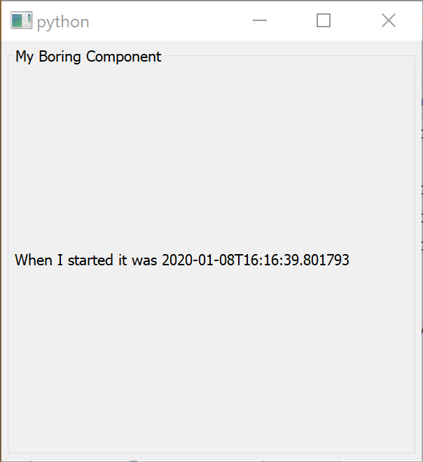
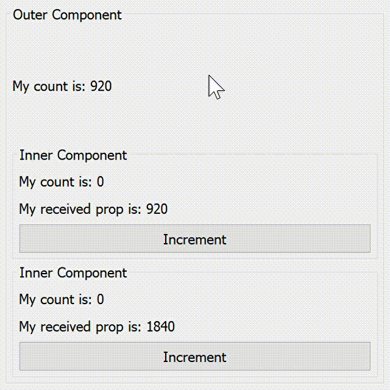
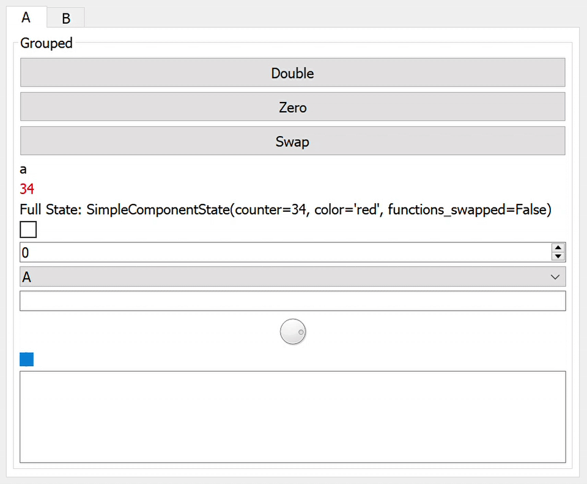

Examples
--------

A library of current examples can be found in the ``examples/`` folder.
You can run them as python modules, or if you want to modify them:

.. code-block:: bash

   $> pip install watchgod
   $> watchgod examples.[example_name].main

Some notes are also included below.

Basic Example
=============

This example shows how to create a custom component that renders static UI. Note that by using
``extra_qt.renderers.qt_renderer``, ``extra_qt`` makes a window for us.
You can also pass a node (in the case of Qt rendering, a `QWidget`) to mount
the render tree onto. This allows you to use ``extra_qt`` to provide the UI only
in part of your application, or onto a window's ``.centralWidget``.

.. literalinclude:: /../../examples/basic.py
   :linenos:

Nesting Components
==================

You can nest a ``Component`` inside another ``Component``, and they will be instantiated
with their own state and properties. In order to render a component into the tree,
use ``MyComponent.c`` (**do not** use the constructor, ``MyComponent.Render`` returns
a representation of the UI and not the ``QWidget`` itself!). ``MyComponent.c`` is just shorthand
for ``create_element(MyComponent, ...)`` so you can use that too.

.. literalinclude:: /../../examples/nested_components.py
   :linenos:

UI Elements Library
===================

Showcases some of the UI elements available as primitives in ``extra_qt``.

.. literalinclude:: /../../examples/ui_elements.py
   :linenos:
